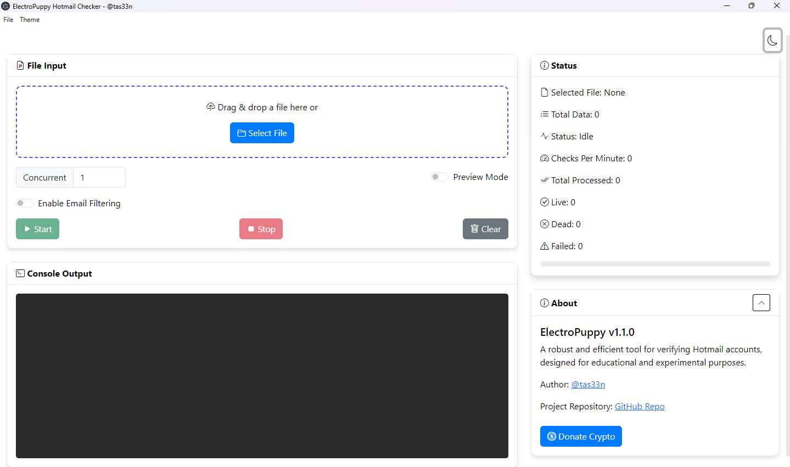
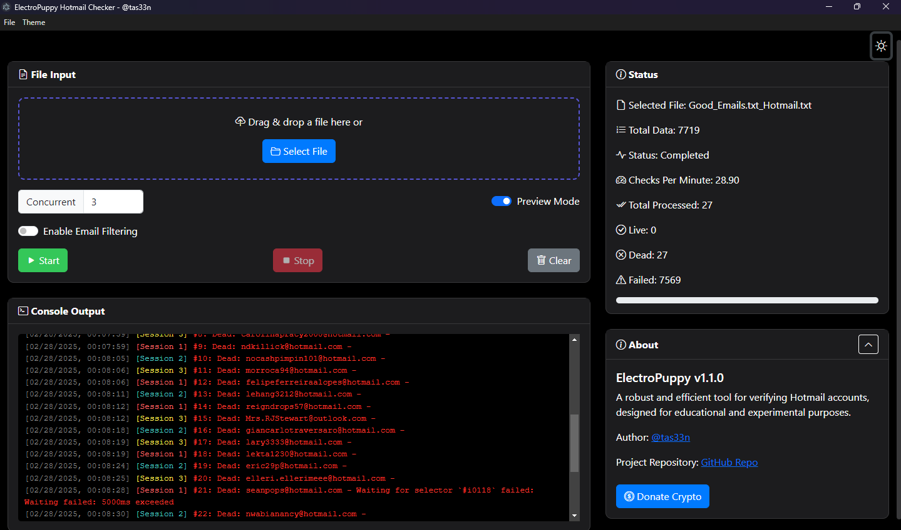
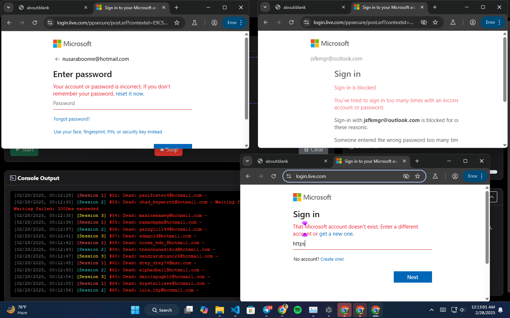

<p align="center">
  
</p>

<h1 align="center">ElectroPuppy Hotmail Checker</h1>

<p align="center">
  <strong>⚡ Lightning-fast Hotmail/Outlook Email Authentication Tool</strong>
</p>

<p align="center">
  <a href="https://github.com/tas33n/ElectroPuppy-Hotmail-Checker/releases/latest">
    
  </a>
  <a href="https://github.com/tas33n/ElectroPuppy-Hotmail-Checker/releases">
    
  </a>
  <a href="https://github.com/tas33n/ElectroPuppy-Hotmail-Checker/commits/main">
    
  </a>
</p>

<div align="center">
  <a href="#features">Features</a> •
  <a href="#-whats-new">What's New</a> •
  <a href="#installation">Installation</a> •
  <a href="#usage">Usage</a> •
  <a href="#-roadmap">Roadmap</a> •
  <a href="#donation">Donation</a>
</div>

---

## 🚀 Features

- **High-Speed Checking** - Concurrent processing engine
- **Theme Support** - Light/Dark/System modes
- **Smart Filtering** - Domain-based email filtering
- **Portable** - No installation required
- **Stealth Mode** - Puppeteer-extra with stealth plugins
- **Real-time Stats** - Live progress tracking

---

## Preview

<p align="center">
  
</p>

<p align="center">
  

<p align="center">
  
</p>

---

## 📥 Installation

1. Download the latest release from the [releases page](https://github.com/tas33n/ElectroPuppy-Hotmail-Checker/releases).
2. Extract the ZIP file to your preferred location.
3. Run the \`ElectroPuppy Hotmail Checker.exe\` file to start the application.

<!-- ```bash
# Windows Portable Edition
1. Download latest release from [Releases Page]
2. Extract ZIP to preferred location
3. Run 'ElectroPuppy Hotmail Checker.exe'

# Developer Setup
1. Clone repo & install dependencies
   git clone https://github.com/tas33n/ElectroPuppy-Hotmail-Checker
   cd ElectroPuppy-Hotmail-Checker
   npm install
2. Start in development mode
   npm run dev
``` -->

> **Note**  
> Portable version requires Windows 10/11  
> Antivirus may flag executable - add exclusion if needed

---

## 🕹️ Usage

1. **Import Data**  
   Drag-n-drop or select email:password list
2. **Configure**  
   Set concurrency (1-5 threads) and filters
3. **Launch**  
   Click Start and monitor real-time results

---

## 🗺️ Roadmap

- ✅ ~~Email Filtering v1~~ (Implemented)
- 🚧 Proxy Support (In Development)
- 🔜 Cross-Platform Compatibility
- 🔜 Advanced Reporting System
- 🔜 Two-Factor Authentication Support

[View Full Roadmap](https://github.com/tas33n/ElectroPuppy-Hotmail-Checker/issues/1)

---

## ⚠️ Disclaimer

> This software is intended for **educational purposes only**. Users are solely responsible for ensuring they have proper authorization to verify any email accounts. The developers assume no liability for misuse.

---

## 💖 Support the Project

Help keep ElectroPuppy evolving! Your donations fuel development:

| Cryptocurrency | Address                                      |
| -------------- | -------------------------------------------- |
| **BTC**        | `bc1q3vyqhfw69f5ug74fj82zwtgszz6dv7mahdlv57` |
| **USDT**       | `TR95UPDfsB1Ammyj4w62xDuAJEA8wH5GSz` (TRC20) |
| **LTC**        | `LeaKUHCiAhRa6U3jrQa4bCAvaAfniJ6pXP`         |

Or support via **Binance Pay**:  
`471390205`

---

<p align="center">
  Developed with ❤️ by <a href="https://github.com/tas33n">@tas33n</a>  
  Enhanced by GPT-4 | 📧 <a href="https://t.me/lamb3rt">Contact via Telegram</a>
</p>
